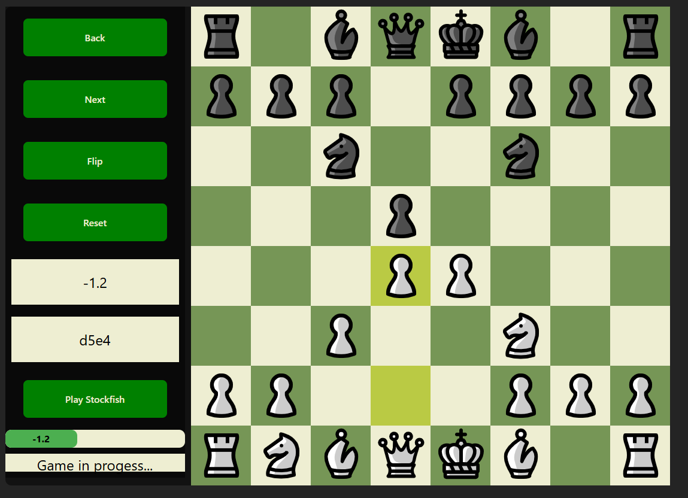

# Projekt

Mateusz Bielak 316710

Projekt umożliwia grę w szachy, analizę meczów, wspartą przez silnik Stockfish.
https://github.com/official-stockfish/Stockfish

Strona: https://chessmateuszbielak.netlify.app/

# Składowe

Strona jest napisana w React przy użyciu Vite. Użyte zostały następujące biblioteki:

- react-dnd: React Drag-and-Drop https://react-dnd.github.io/react-dnd/about
- Redux Toolkit: https://redux-toolkit.js.org/
- implementacja Stockfisha jako WASM: https://github.com/nmrugg/stockfish.js/tree/master

# Wygląd

# Funkcjonalności

- normalna gra lokalna
- analiza posunięć z użyciem silnika Stockfish
- rozgrywka przeciwko silnikowi Stockfish
- analiza pozycji w meczu

# React + Vite

This template provides a minimal setup to get React working in Vite with HMR and some ESLint rules.

Currently, two official plugins are available:

- [@vitejs/plugin-react](https://github.com/vitejs/vite-plugin-react/blob/main/packages/plugin-react/README.md) uses [Babel](https://babeljs.io/) for Fast Refresh
- [@vitejs/plugin-react-swc](https://github.com/vitejs/vite-plugin-react-swc) uses [SWC](https://swc.rs/) for Fast Refresh
